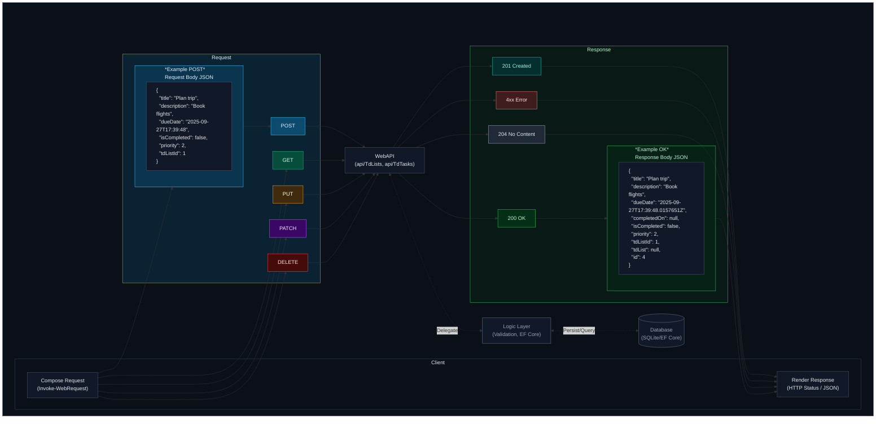

This repository contains the Moodle assignment for SEeToDoList (assignment code: 2526_78ABIF_78ACIF_POS_GEHR)

## 1. Assignment Overview

The exact exercise content (as fetched from Moodle) is available here:

- [Moodle Assignment (exact content)](angabe/moodle_angabe.md)

## 2. Finished Assignment

### 2.1. WebAPI

---

## 3. Submission Guidelines

- Submission is done via a Git repository with a clean commit history.

- Diagrams must be embedded as images in Markdown files.

## 4. Recommended Git Workflow

- Keep the `master` branch stable.

- Use feature branches for discrete tasks.

- Write clear, concise, and meaningful commit messages.

## 5. Repository Structure

- `angabe/`: Contains the original assignment description (exact Moodle content).

- `docs/`: Holds diagrams, explanations, other documentation and external sources like PDFs.

- Course specific directories:
  e.g. `<course_specific_directory>/` (for example `sql/` for DDL, DML, and example queries).

### API Test Documentation

- See detailed REST tests, results, and diagram: [docs/API_test_results_dokumentation.md](docs/API_test_results_dokumentation.md)

---

<!--
Update Log
  - Description   : Updated README formatting and clarified assignment structure.
  - Date          : 2025-09-27 12:10
  - Author        : IxI-Enki
  - Version       : 1.1.1
-->
