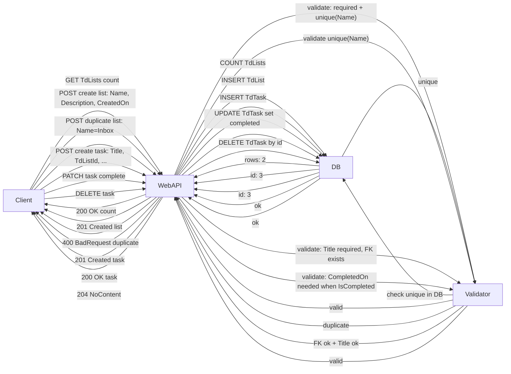

### API Test Results



#### Environment

- Base URL: `https://localhost:7074/api`
- Date/Time (UTC ISO-8601 for payloads): `2025-09-27T16:55:32.1725576Z`
- Note: HTTPS with certificate check disabled during testing.

---

#### Test 01: GET /TdLists/count

- Method: GET
- URL: `/TdLists/count`
- Expected: 200 OK with integer count
- Actual: 200 OK
- Response Body:

```
2
```

---

#### Test 02: POST /TdLists (create Personal)

- Method: POST
- URL: `/TdLists`
- Body:

```json
{
  "name": "Personal",
  "description": "Personal list",
  "createdOn": "2025-09-27T16:55:32.1725576Z"
}
```

- Expected: 201 Created
- Actual: 201 Created
- Response Body:

```json
{
  "name": "Personal",
  "description": "Personal list",
  "createdOn": "2025-09-27T16:55:32.1725576Z",
  "completedOn": null,
  "tasks": [],
  "id": 3
}
```

---

#### Test 03 (Failure): POST /TdLists (duplicate Inbox)

- Method: POST
- URL: `/TdLists`
- Body:

```json
{
  "name": "Inbox",
  "description": "Dup test",
  "createdOn": "2025-09-27T16:55:32.1725576Z"
}
```

- Expected: 400 BadRequest (duplicate name)
- Actual: 400 BadRequest
- Response Body:

```
[0] BusinessRuleException: A list with the name 'Inbox' already exists.
```

---

#### Test 04: GET /TdLists (list all)

- Method: GET
- URL: `/TdLists`
- Expected: 200 OK with existing lists
- Actual: 200 OK
- Response Body:

```json
[
  {
    "name": "Inbox",
    "description": "Default list",
    "createdOn": "2025-09-27T16:50:24.0004871Z",
    "completedOn": null,
    "tasks": [],
    "id": 1
  },
  {
    "name": "Work",
    "description": "Work related",
    "createdOn": "2025-09-27T16:50:24.0004871Z",
    "completedOn": null,
    "tasks": [],
    "id": 2
  },
  {
    "name": "Personal",
    "description": "Personal list",
    "createdOn": "2025-09-27T16:55:32.1725576Z",
    "completedOn": null,
    "tasks": [],
    "id": 3
  }
]
```

---

#### Test 05: POST /TdTasks (valid on Personal)

- Method: POST
- URL: `/TdTasks`
- Body:

```json
{
  "title": "Plan trip",
  "description": "Book flights",
  "dueDate": "2025-09-27T16:55:32.1725576Z",
  "isCompleted": false,
  "priority": 2,
  "tdListId": 3
}
```

- Expected: 201 Created
- Actual: 201 Created
- Response Body:

```json
{
  "title": "Plan trip",
  "description": "Book flights",
  "dueDate": "2025-09-27T16:55:32.1725576Z",
  "completedOn": null,
  "isCompleted": false,
  "priority": 2,
  "tdListId": 3,
  "tdList": null,
  "id": 3
}
```

---

#### Test 06 (Failure): POST /TdTasks (missing Title)

- Method: POST
- URL: `/TdTasks`
- Body:

```json
{
  "title": "",
  "description": "missing title",
  "tdListId": 3,
  "isCompleted": false,
  "priority": 3
}
```

- Expected: 400 BadRequest
- Actual: 400 BadRequest
- Response Body:

```
[0] BusinessRuleException: The value of Title '' is not valid.
```

---

#### Test 07 (Failure): POST /TdTasks (isCompleted without CompletedOn)

- Method: POST
- URL: `/TdTasks`
- Body:

```json
{
  "title": "Finish taxes",
  "description": "no completedOn",
  "isCompleted": true,
  "priority": 1,
  "tdListId": 3
}
```

- Expected: 400 BadRequest
- Actual: 400 BadRequest
- Response Body:

```
[0] BusinessRuleException: If IsCompleted is true, CompletedOn must have a value.
```

---

#### Test 08 (Failure): POST /TdTasks (non-existent TdListId)

- Method: POST
- URL: `/TdTasks`
- Body:

```json
{
  "title": "Orphan task",
  "description": "invalid list",
  "isCompleted": false,
  "priority": 3,
  "tdListId": 999999
}
```

- Expected: 400 BadRequest
- Actual: 400 BadRequest
- Response Body:

```
[0] BusinessRuleException: Referenced TdListId '999999' does not exist.
```

---

#### Test 09: PUT /TdTasks/{id} (update)

- Method: PUT
- URL: `/TdTasks/3`
- Body:

```json
{
  "title": "Plan summer trip",
  "description": "Book and plan",
  "dueDate": "2025-09-27T16:55:32.1725576Z",
  "isCompleted": false,
  "priority": 1,
  "tdListId": 3
}
```

- Expected: 200 OK
- Actual: 200 OK
- Response Body:

```json
{
  "title": "Plan summer trip",
  "description": "Book and plan",
  "dueDate": "2025-09-27T16:55:32.1725576Z",
  "completedOn": null,
  "isCompleted": false,
  "priority": 1,
  "tdListId": 3,
  "tdList": null,
  "id": 3
}
```

---

#### Test 10: PATCH /TdTasks/{id} (complete task)

- Method: PATCH
- URL: `/TdTasks/3`
- Body:

```json
[
  {
    "op": "replace",
    "path": "/isCompleted",
    "value": true
  },
  {
    "op": "replace",
    "path": "/completedOn",
    "value": "2025-09-27T16:55:32.1725576Z"
  }
]
```

- Expected: 200 OK
- Actual: 200 OK
- Response Body:

```json
{
  "title": "Plan summer trip",
  "description": "Book and plan",
  "dueDate": "2025-09-27T16:55:32.1725576Z",
  "completedOn": "2025-09-27T16:55:32.1725576Z",
  "isCompleted": true,
  "priority": 1,
  "tdListId": 3,
  "tdList": null,
  "id": 3
}
```

---

#### Test 11: DELETE /TdTasks/{id}

- Method: DELETE
- URL: `/TdTasks/3`
- Expected: 204 NoContent
- Actual: 204 NoContent

---

#### Test 12: GET /TdTasks/count

- Method: GET
- URL: `/TdTasks/count`
- Expected: 200 OK
- Actual: 200 OK
- Response Body:

```
2
```
