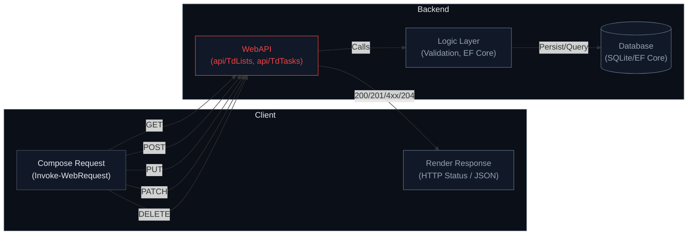

### API Test Results



#### Context

- Base URL: `https://localhost:7074/api`
- Test time (UTC): see timestamps in responses
- Entities: `TdLists`, `TdTasks`

---

#### T01: GET /TdLists/count

Request:

```http
GET /api/TdLists/count
```

Response:

```http
200 OK
Body: 3
```

Notes: Verifies API is reachable and lists exist.

---

#### T02: POST /TdLists (create Personal)

Request:

```http
POST /api/TdLists
Content-Type: application/json

{
  "name": "Personal",
  "description": "Personal list",
  "createdOn": "<now>"
}
```

Response:

```http
400 BadRequest
Body: [0] BusinessRuleException: A list with the name 'Personal' already exists.
```

Notes: Expected failure due to unique Name constraint.

---

#### T03: POST /TdLists (create Inbox duplicate)

Request:

```http
POST /api/TdLists
Content-Type: application/json

{
  "name": "Inbox",
  "description": "Dup test",
  "createdOn": "<now>"
}
```

Response:

```http
400 BadRequest
Body: [0] BusinessRuleException: A list with the name 'Inbox' already exists.
```

Notes: Expected failure; duplicates are prevented.

---

#### T04: GET /TdLists (list all)

Request:

```http
GET /api/TdLists
```

Response (truncated):

```json
[
  { "name": "Inbox", "id": 1, "tasks": [] },
  { "name": "Work", "id": 2, "tasks": [] },
  { "name": "Personal", "id": 3, "tasks": [] }
]
```

Notes: Confirms existing three lists.

---

#### T05: POST /TdTasks (create Plan trip)

Request:

```http
POST /api/TdTasks
Content-Type: application/json

{
  "title": "Plan trip",
  "description": "Book flights",
  "dueDate": "<now>",
  "isCompleted": false,
  "priority": 2,
  "tdListId": 1
}
```

Response:

```json
{
  "title": "Plan trip",
  "description": "Book flights",
  "dueDate": "2025-09-27T17:39:48.0157651Z",
  "completedOn": null,
  "isCompleted": false,
  "priority": 2,
  "tdListId": 1,
  "tdList": null,
  "id": 4
}
```

Notes: Task created under list `1` (Inbox).

---

#### T06: POST /TdTasks (missing title)

Request:

```http
POST /api/TdTasks
Content-Type: application/json

{
  "title": "",
  "description": "missing title",
  "tdListId": 1,
  "isCompleted": false,
  "priority": 3
}
```

Response:

```http
400 BadRequest
Body: [0] BusinessRuleException: The value of Title '' is not valid.
```

Notes: Expected validation failure.

---

#### T07: POST /TdTasks (completed without completedOn)

Request:

```http
POST /api/TdTasks
Content-Type: application/json

{
  "title": "Finish taxes",
  "description": "no completedOn",
  "isCompleted": true,
  "priority": 1,
  "tdListId": 1
}
```

Response:

```http
400 BadRequest
Body: [0] BusinessRuleException: If IsCompleted is true, CompletedOn must have a value.
```

Notes: Expected validation failure.

---

#### T08: POST /TdTasks (invalid TdListId)

Request:

```http
POST /api/TdTasks
Content-Type: application/json

{
  "title": "Orphan task",
  "description": "invalid list",
  "isCompleted": false,
  "priority": 3,
  "tdListId": 999999
}
```

Response:

```http
400 BadRequest
Body: [0] BusinessRuleException: Referenced TdListId '999999' does not exist.
```

Notes: Expected referential integrity failure.

---

#### T09: PUT /TdTasks/{id} (update task)

Request:

```http
PUT /api/TdTasks/4
Content-Type: application/json

{
  "title": "Plan summer trip",
  "description": "Book and plan",
  "dueDate": "2025-09-27T17:39:48.0157651Z",
  "isCompleted": false,
  "priority": 1,
  "tdListId": 1
}
```

Response (200 OK):

```json
{
  "title": "Plan summer trip",
  "description": "Book and plan",
  "dueDate": "2025-09-27T17:39:48.0157651Z",
  "completedOn": null,
  "isCompleted": false,
  "priority": 1,
  "tdListId": 1,
  "tdList": null,
  "id": 4
}
```

Notes: Update succeeded.

---

#### T10: PATCH /TdTasks/{id} (complete task)

Request:

```http
PATCH /api/TdTasks/4
Content-Type: application/json

[
  { "op": "replace", "path": "/isCompleted", "value": true },
  { "op": "replace", "path": "/completedOn", "value": "2025-09-27T17:39:48.0157651Z" }
]
```

Response (200 OK):

```json
{
  "title": "Plan summer trip",
  "description": "Book and plan",
  "dueDate": "2025-09-27T17:39:48.0157651Z",
  "completedOn": "2025-09-27T17:39:48.0157651Z",
  "isCompleted": true,
  "priority": 1,
  "tdListId": 1,
  "tdList": null,
  "id": 4
}
```

Notes: Task is now completed.

---

#### T11: DELETE /TdTasks/{id}

Request:

```http
DELETE /api/TdTasks/4
```

Response:

```http
204 NoContent
```

Notes: Task deleted successfully.

---

#### T12: GET /TdTasks/count

Request:

```http
GET /api/TdTasks/count
```

Response:

```http
200 OK
Body: 2
```

Notes: Reflects one task removed; remaining count is 2.
